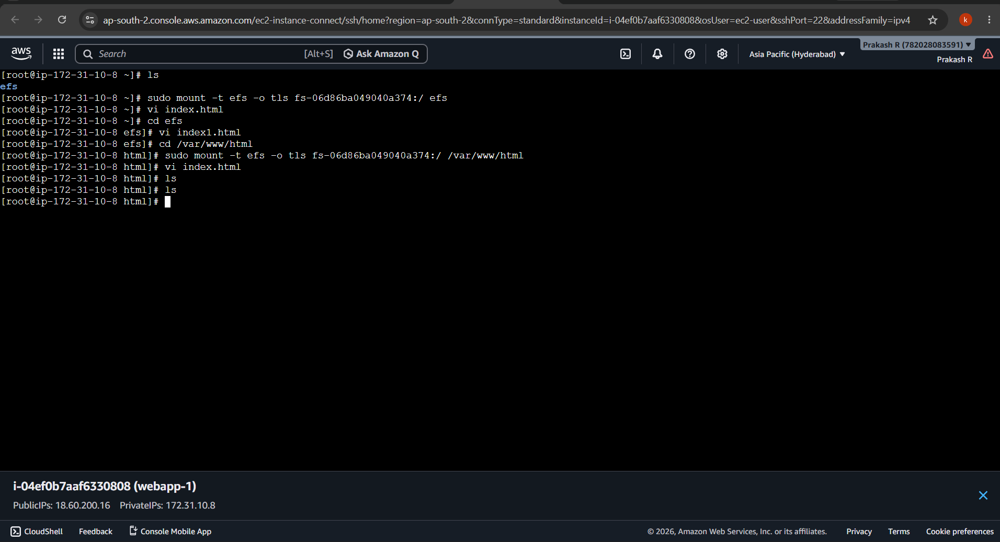
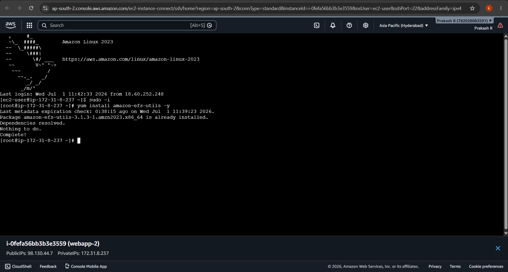
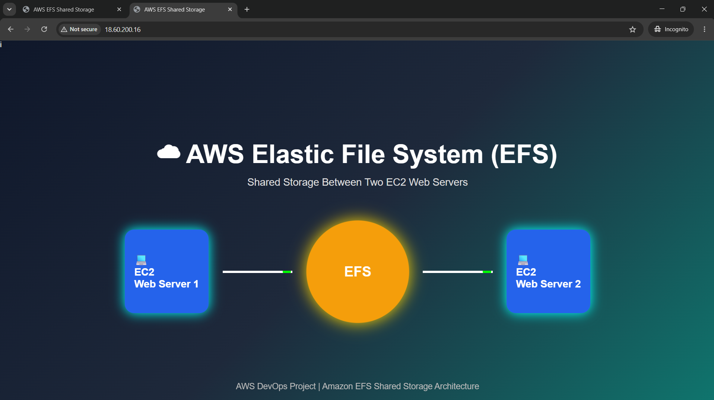
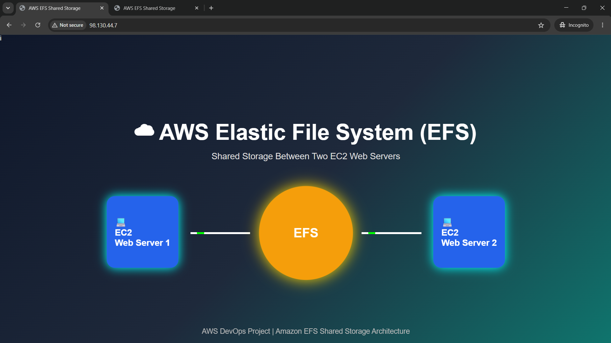

<div align="center">

# ☁️ AWS Elastic File System (EFS) Shared Storage

### Deploying a Highly Available Web Application Using Amazon EFS and EC2


</div>

---

# 📖 Project Overview

This project demonstrates how to configure **Amazon Elastic File System (EFS)** as a shared storage solution between two Amazon EC2 web servers. Both servers mount the same EFS file system, allowing them to access and serve identical website content from a centralized location.

---

# 🏗️ Architecture

```
                   Internet
                       │
                Public IP Address
                       │
        ┌──────────────┴──────────────┐
        │                             │
 +---------------+             +---------------+
 | EC2 WebServer1|             | EC2 WebServer2|
 | Apache HTTPD  |             | Apache HTTPD  |
 +-------+-------+             +-------+-------+
         \                           /
          \                         /
           \                       /
            +---------------------+
            |    Amazon EFS       |
            | Shared File System  |
            +---------------------+
```

---

# ☁️ AWS Services Used

- Amazon EC2
- Amazon EFS
- Amazon VPC
- Security Groups
- Amazon Linux 2023
- Apache HTTP Server (httpd)

---

# 🚀 Features

- Shared Storage using Amazon EFS
- Two Apache Web Servers
- Centralized Website Files
- Secure NFS Mount
- High Availability Architecture
- Easy Content Management

---

# 🛠️ Implementation Steps

## Step 1 – Launch Two EC2 Instances

- Amazon Linux 2023
- Same VPC
- Same Security Group

---

## Step 2 – Install Apache

```bash
sudo yum install httpd -y
sudo systemctl enable httpd
sudo systemctl start httpd
```

---

## Step 3 – Install Amazon EFS Utilities

```bash
sudo yum install amazon-efs-utils -y
```

---

## Step 4 – Mount EFS

```bash
sudo mount -t efs -o tls fs-xxxxxxxx:/ /var/www/html
```

---

## Step 5 – Create Website

```bash
cd /var/www/html
sudo vi index.html
```

---

## Step 6 – Verify

Open the Public IP address of either EC2 instance.

Both servers display the same webpage because the website is stored on Amazon EFS.

---

## 🖥️ Web Server 1 Terminal



---

## 🖥️ Web Server 2 Terminal



---

## 🌐 Website Output (Server 1)



---

## 🌐 Website Output (Server 2)


---

# 📁 Project Structure

```
aws-efs-shared-storage/
│
├── README.md
├── index.html
└── images/
    ├── server1-terminal.png
    ├── server2-terminal.png
    ├── website-output1.png
    └── website-output2.png
```

---

# 🎯 Skills Demonstrated

- AWS EC2
- Amazon EFS
- Linux Administration
- Apache HTTP Server
- Shared Storage
- NFS
- Cloud Infrastructure
- High Availability

---

# 📚 Learning Outcomes

- Created and configured Amazon EFS.
- Mounted EFS on multiple EC2 instances.
- Hosted a shared website using Apache.
- Verified centralized storage across web servers.
- Gained hands-on experience with AWS storage and Linux administration.

---

# 👨‍💻 Author

**Kishore G**

**Aspiring AWS Cloud & DevOps Engineer**

- GitHub: https://github.com/KISHORE-2605
- LinkedIn: https://www.linkedin.com/in/kishore-g005
